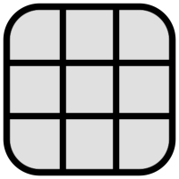

# Quadradado

Quadradado é um jogo simples desenvolvido com React e TypeScript, mais informações sobre o jogo no próprio site clicando no ícone de ajuda.

## 📚 Tecnologias Utilizadas

- **React**: Biblioteca para construção de interfaces de usuário.
- **TypeScript**: Superset de JavaScript que adiciona tipagem estática ao projeto.
- **ESLint**: Ferramenta para padronização e limpeza do código.

## ✨ Features

- Interface totalmente responsiva, otimizando a experiência em dispositivos móveis.
- Configuração de ESLint para manter a consistência do código.
- Sem dependências externas para estilização, garantindo maior controle e personalização.
- Outras pequenas features como o uso de Open Graph para informações do site em preview, uso de Local Storage para guardar palavras já encontradas, a possibilidade de trocar de tema etc.

## 🚀 Como Executar

1. Clone o repositório:
   ```bash
   git clone https://github.com/Alex-Silva0/quadradado.git
   cd quadradado
   ```

2. Instale as dependências:
   ```bash
   npm install
   ```

3. Inicie o servidor de desenvolvimento:
   ```bash
   npm run dev
   ```

4. Acesse o projeto em `http://localhost:5173/`.

### Notas:

- Existe um outro mini projeto relacionado em python que não está incluído aqui, para encontrar todas as possibilidades possíveis e filtrar as palavras.
